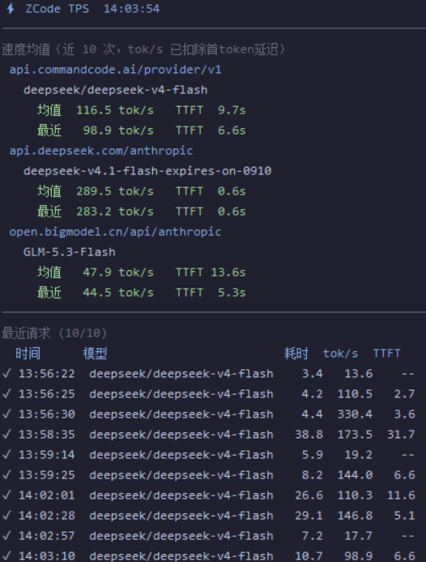

# zcode-tps-overlay

[](LICENSE)


**ZCode 模型请求速度悬浮窗监控插件。** 置顶半透明悬浮窗实时显示各 (baseURL, 模型) 的出词速度
与首 token 延迟(TTFT)——数据直接读取 ZCode usage 数据库,真实 token 数,非估算;并提供 MCP
工具供模型启停监控、切换界面语言、查询会话统计。

> 本仓库同时是一个 ZCode 插件市场(marketplace 名称:`zcode-tps`),插件本体位于
> [`plugins/zcode-tps-overlay/`](plugins/zcode-tps-overlay/)。
>
> **0.2.0 起 Python 解释器不再写死**:由 Node 启动器在运行时动态解析,首次使用可用
> `tps-setup` skill 自动定位;换机器、换 conda 环境后自愈。

## 效果预览

悬浮窗右上角常驻,自动跟随 zcode 的模型请求刷新,无需任何手动操作:



| 区域/字段 | 含义 |
|---|---|
| `avg` / `last tok/s` | 该模型近 10 次平均 / 最近一次出词速度(输出 token ÷ 流式生成时长,已扣除首 token 延迟) |
| `TTFT` | 首 token 延迟:均值行=近 10 次平均,列表行=该次延迟。**纯工具调用的响应没有此数据**(ZCode 不记录),显示 `--`,详见下方"两种速度口径" |
| 额度卡片 | 三个窗口各一张卡片:**剩余**百分比(官方页面显示的是已用额度)、彩色进度条与重置倒计时;60s 刷新,倒计时每秒自走 |
| 额度汇总行 | 卡片上方一行:`$31.0 可用额度 · 639.6M tokens · 5,218 runs`,即页面 Overview 的可用额度、本期总 token 与总请求数 |
| 折叠/展开 | 每个区块标题左侧的 `▾` / `▸` 即开关,点击折叠该区块(额度、速度均值、最近请求均可独立折叠),状态写入 `~/.zcode/tps.json` 持久保存 |
| 最近请求表 | 滚动保留最近 10 次:`●` 进行中(dur 实时增长)、`✓` 已完成、`✗` 失败;**`~` 开头且显示为暗色的行见下方"两种速度口径"** |
| 边缘吸附 | 拖到屏幕上/下/左/右边缘自动滑入隐藏(露出 20px 可见边,与悬停弹出范围一致),鼠标碰边滑出、移开缩回;拖回屏幕中间取消吸附 |

额度卡片按剩余比例变色:≥50% 绿、20–50% 黄、<20% 红。界面语言 `en` / `zh` 可热切换
(见下文"配置")。

### 两种速度口径(重要)

速度列里有两种数字,因为 ZCode 对**纯工具调用的响应不记录首 token 时间**
(`time_to_first_token_ms` 为空,且 `first_token_at` 也是空——这类响应只有 `step-start /
tool / step-finish`,没有正文或思考内容,首个 token 就无从判定)。今天约 25–43% 的请求属此类,
集中在工具密集阶段。

| | 计算 | 显示 | 是否计入均值 |
|---|---|---|---|
| 有 TTFT(含正文/思考) | 输出 token ÷ (总耗时 − 首 token 延迟) | ` 244.5`,正常色 | **是** |
| 无 TTFT(纯工具调用) | 输出 token ÷ 总耗时(含首字等待) | `~ 37.7`,暗色 + 表内图例 | **否** |

两者含义不同,所以**不能混在一起平均**——早期版本混算,导致工具密集期均值被拖低约 37%
(实测 266.3 被算成 167.7)。现在 `~` 行只展示、不参与均值,均值始终是同一口径的平均。

已知限制:这些行的真实流式速率**无法还原**(缺少 TTFT 且无其他时间戳可用),`~` 值必然偏低,
只能作为"这一次端到端跑了多少"的参考。要判断模型快慢请以均值区(有 TTFT 的行)为准。

## 功能特性

- **真实速度监控** —— 悬浮窗顶部按 (baseURL, 模型) 分组展示均值/最近出词速度与 TTFT 均值,
  数据来自 usage 数据库的 `model_usage` 表(真实 token 数与 `time_to_first_token_ms`)
- **最近请求滚动列表** —— 最近 10 次请求表格,进行中实时计时,完成就地补该次速度与 TTFT;
  口径不可比的行(纯工具调用无 TTFT)标 `~` 并以暗色区分、不计入均值
- **Command Code 额度监控** —— 自动识别配置里的 Command Code provider,以卡片形式展示
  5 小时 / 周 / 月三个窗口的剩余额度、彩色进度条与重置倒计时(官方页面显示的是已用,
  这里换算成剩余),额度不足时无需再开浏览器
- **按区块折叠** —— 额度、速度均值、最近请求各自可点击标题折叠,窗口只留关心的部分;
  折叠状态持久化,重开也保持
- **边缘吸附隐藏** —— 拖到屏幕边缘自动让位,鼠标悬停滑出,不遮挡其它工作
- **MCP 工具** —— `tps_start` / `tps_stop` / `tps_status` / `tps_language` / `tps_session_stats`,
  模型可程序化启停监控与取数
- **自动拉起** —— 会话启动自动运行悬浮窗(可配置关闭);运行实例防重复
- **双语言 UI** —— `en` / `zh` 热切换,不重启
- **解释器自动定位** —— Python 路径运行时解析并写入 `~/.zcode/tps.json`,换机器/换环境自愈;
  找不到时由 `tps-setup` skill 引导定位与安装,不依赖任何硬编码路径
- 实现仅依赖 Python 标准库(tkinter),MCP 协议手写,零第三方包;不改任何 zcode 配置

## 安装

### 方式一:从 GitHub 添加(推荐)

在 ZCode 中执行:

```text
/plugin marketplace add FrankZhangIronly/zcode-tps
/plugin install zcode-tps-overlay@zcode-tps
```

或在 **设置 → 插件管理 → 发现 → "+"** 添加 GitHub 仓库 `FrankZhangIronly/zcode-tps`,
刷新市场列表后安装 **zcode-tps-overlay**。也可以在本地先运行 `node install.mjs`
(把本仓库注册进 `~/.zcode/cli/plugins/known_marketplaces.json`,幂等)。

### 方式二:本地目录

克隆本仓库后,在 ZCode 中打开 **设置 → 插件管理 → 发现 → +**,来源选择"本地目录",
指向仓库根目录即可。

### 更新

```text
/plugin marketplace update zcode-tps
/plugin update zcode-tps-overlay@zcode-tps
```

更新后重开会话使钩子与 MCP server 重新加载。

## 首次运行(解释器自动配置)

插件不再假设 Python 装在哪里。启动器(`mcp/launch.mjs`、SessionStart hook、`start.mjs`)
每次按下面的优先级在**运行时**解析解释器:

1. `--python <path>`(仅 `tps-setup` 用)
2. 环境变量 `TPS_PYTHON`
3. `~/.zcode/tps.json` 的 `python` 字段
4. 自动发现 —— `py -0p` 注册表、`PATH`、常见安装位,以及 conda/mamba 环境
   (含 Windows 各盘符下的 `*conda3*\envs\*`)

候选必须实测通过 `import tkinter, sqlite3` 且为 Python 3.8+ 才会被采用,因此
Windows 的 Microsoft Store 占位符、没有 tkinter 的 macOS Xcode `python3` 会被自动淘汰。

**大多数情况无需任何操作**:会话启动时 hook 会自动找到并写好 `~/.zcode/tps.json`。
兜底路径:

| 情况 | 做法 |
|---|---|
| 悬浮窗没出现 / `tps_*` 工具缺失 | 让模型运行 `tps-setup` skill,或手动 `npm run setup` |
| 自己指定解释器 | `node plugins/zcode-tps-overlay/skills/tps-setup/setup.mjs --python "<路径>" --start` |
| 只是想看当前配置 | `node plugins/zcode-tps-overlay/skills/tps-setup/setup.mjs --json` |
| 没有 Python | `tps-setup` 会给出各平台安装命令(Windows `winget install Python.Python.3.12`;macOS `brew install python-tk`;Ubuntu `sudo apt install python3-tk`) |

配置写入后,**MCP 工具需重开会话**才会加载(server 进程在会话启动时定好解释器);
悬浮窗本身会立即启动。若配置的解释器失效(如删掉了 conda 环境),下次运行会自动
重新发现并修正配置,无需手工干预。

## 使用

| 场景 | 操作 |
|---|---|
| 随时查看速度 | 无需操作,悬浮窗自动跟随刷新 |
| 悬浮窗没出现 | 输入 `/zcode-tps-overlay:tps` 看状态,或让模型调用 `tps_start` |
| 模型查询会话统计 | 模型调用 MCP 工具 `tps_session_stats`(当前会话最近 N 条请求的速度/TTFT 明细与汇总) |
| 切换界面语言 | 模型调用 `tps_language`,或编辑 `~/.zcode/tps.json` 写 `{"language": "zh"}`(en/zh,~0.5s 生效) |
| 关闭自动拉起 | `~/.zcode/tps.json` 写入 `{"autostart": false}`,重开会话生效 |
| 独立运行(不装插件) | `node start.mjs` / `node start.mjs --stop`(入口 `plugins/zcode-tps-overlay/overlay/tps_monitor.py`) |

要求:**Windows / Linux / macOS**;Node 18+(hook 与启动器,随 zcode 环境提供);
Python 3.8+(标准库含 tkinter 与 sqlite3,路径自动发现,可用 `TPS_PYTHON` 或
`tps.json` 指定)。开发与测试:`npm test`(零依赖,`node --test`)。

已实测 Windows;Linux/macOS 为 best-effort(代码路径已跨平台化,但未在实机验证)。
已知限制:Linux 下 Tk 不支持窗口透明度(`-alpha` 失效,会自动降级为不透明);
Wayland 下置顶取决于合成器。

## 工作原理

```
zcode 会话启动
  │
  ├─ SessionStart hook (hooks/session-start.mjs)
  │    ├─ 记录 sessionId → ~/.zcode/tps.state.json
  │    ├─ 运行时解析 Python 解释器(lib/python.mjs,失效则自愈重写 tps.json)
  │    └─ autostart=true 时拉起悬浮窗(分离进程,pid 文件防重复)
  │         找不到解释器时 → 在 additionalContext 里要求模型调用 tps-setup skill
  │
  └─ MCP server (mcp/launch.mjs → overlay/tps_server.py,stdio 换行分隔 JSON-RPC)
       ├─ launcher 解析解释器后把 stdio 原样透传给 Python server
       ├─ tps_status 快照:复用与悬浮窗相同的采集逻辑(tail 请求日志 + 轮询 usage 库)
       └─ tps_session_stats:按 tps.state.json 的会话 ID 直接查询 model_usage 表

悬浮窗 (overlay/tps_monitor.py, tkinter)
  ├─ tail ~/.zcode/cli/log/zcode-YYYY-MM-DD.jsonl
  │    model.request.started → 进行中行(●,实时计时)
  ├─ 轮询 model_usage 表(只读 WAL,1.5s/次)
  │    completed 行 → 按 traceId+开始时间就近配对,补 dur/tok/s/TTFT,滚动保留 10 条
  └─ 轮询 Command Code 额度(60s/次,仅 GET,只读)
       billing/credits + usage/summary + billing/subscriptions → 剩余额度与重置时间
```

- **解释器解析**:单一实现 `lib/python.mjs`,被 hook、MCP launcher、`tps-setup`、
  `start.mjs` 四处共用;`.mcp.json` 只写 `command: node`,不再出现任何解释器路径。
- **数据口径**:速度 = 输出 token ÷ (总耗时 − 首 token 延迟),即纯流式生成速度。纯工具调用的
  响应没有首 token 时间可供扣除,只能按总耗时显示并标记为 `~`,且**不参与均值**——两种口径
  不可混算,原因见"两种速度口径"。均值与列表均保留最近 10 次。
- **traceId 陷阱**:一个 turn 内多个请求会复用 traceId,故配对用开始时间就近匹配而非顺序。
- **绘制方式**:额度卡片用 `tk.Canvas` 自绘(Tk 没有圆角/进度条控件)——卡片与药丸底是平滑
  多边形,进度条是圆头线条(平滑多边形在 6px 高度下圆角会吃掉整条并鼓成透镜形,圆头线宽
  恒为 6px)。窗口不重建控件:文本用复用的 Label 池,卡片仅在数值按显示精度变化或窗口宽度
  改变时重画,因此 500ms 刷新不会闪烁。
- **额度数据来源**:直接读 `api.commandcode.ai/alpha/*`(官方 CLI `/usage` 与网页同款接口),
  全程只有只读 GET,复用 `~/.zcode/v2/config.json` 里已配置的 provider 与其 API key;
  不写盘、不发送任何本地数据。接口属未公开路由,失败时静默隐藏额度行,不影响速度监控。
- 悬浮窗与 MCP 共用采集核心 `overlay/tps_core.py`,单份逻辑。

## 常见问题

**Q:显示的速度准确吗?**

A:token 数与 TTFT 来自 `model_usage` 表的真实值(数据库原生记录,含
`time_to_first_token_ms`),非模型自述。口径为"扣除首 token 延迟的纯流式生成速度",
因此比"输出 token ÷ 总耗时"略高;两者之差即首 token 等待占比。均值区的数字始终是这一
口径,可放心用于比较模型快慢。

**Q:为什么有些行是暗色的 `~37.7` 而不是 `244.5`?**

A:那是**纯工具调用**的响应——ZCode 不为这类响应记录首 token 时间(`first_token_at` 与
`time_to_first_token_ms` 均为空),缺少扣除项,只剩端到端总耗时可用,所以数值必然偏低。
为免污染,这些行不参与均值计算,并用 `~` 与暗色标出。它们的真实流式速率无法还原,想看
真实速度请看均值区。详见"两种速度口径"。

**Q:工具密集的时候速度看着变慢了,是模型真的慢了吗?**

A:先区分两件事。早期版本确实有个真实缺陷:把上面说的两种口径混在一起平均,工具密集期
(纯工具调用响应占多数)均值会被拖低约 37%,这一条已修复。另有一层是**模型本身不同**:
工具密集的回合更容易落到较慢的模型上(实测同一时段 GLM-5.3-Flash 约 40 tok/s,
deepseek-v4.1-flash 约 220 tok/s,相差 5 倍),而它们是各自 baseURL 分组下的独立行。
修复后,若均值区仍显示下降,那才是真实的速率变化。

**Q:额度卡片没显示,或数字一直不变?**

A:额度区块只在**配置了 Command Code provider 且密钥可用**时出现,其它 provider 下不显示。
没配 provider、没填 API key、或密钥被拒绝(401/403)时会立刻隐藏整块,不占空间也不报错;
网络抖动或官方接口临时异常则保留上一次读数,超过 5 分钟取不到新数据才隐藏——所以不会
显示过期或归零的错误数字。数字 60 秒刷新一次(重置倒计时每秒自走,不需要重新请求)。
排查见 `~/.zcode/tps.log`。

**Q:窗口太长了,能只看额度不看请求列表吗?**

A:点区块标题左侧的 `▾` 即可折叠(变成 `▸`),再点展开;额度、速度均值、最近请求三个区块
互相独立,可任意组合。折叠状态存在 `~/.zcode/tps.json` 的 `collapsed` 字段里,重启悬浮窗
后保持;想全部展开就删掉该字段。拖到屏幕边缘吸附时,顶部吸附只露标题行,折叠后更容易
常驻。

**Q:悬浮窗没有自动弹出?**

A:运行 `/zcode-tps-overlay:tps` 查看状态,或让模型调用 `tps_start`。常见原因:插件安装后
未重开会话(钩子需新会话注册)、`~/.zcode/tps.json` 里 `autostart` 为 false、悬浮窗进程被
杀后 pid 文件残留(重启即自动清理)。

**Q:提示找不到 Python,或 `tps_*` 工具不出现?**

A:先让模型运行 `tps-setup` skill —— 它会列出所有已探测的候选与淘汰原因,引导定位或安装。
常见根因:Windows 上 `python.exe` 只是 Microsoft Store 占位符(退出码 49);macOS 用的是
Xcode 自带 `/usr/bin/python3`(无 tkinter);Linux 没装 `python3-tk`。装好后重开会话,
MCP 工具才会加载。

**Q:MCP 工具没有出现?**

A:插件 MCP server 在会话启动时自动连接;安装或更新插件后需重开会话。若仍未出现,在
设置 → 插件管理确认插件已安装且市场已刷新到最新版本。

**Q:如何切换中文界面?**

A:让模型调用 `tps_language`(参数 `zh` / `en`),或直接编辑 `~/.zcode/tps.json` 的
`language` 字段;悬浮窗约 0.5 秒内热切换,无需重启。

**Q:改代码后如何生效?**

A:提交并推送 GitHub → `/plugin marketplace update zcode-tps` → `/plugin update
zcode-tps-overlay@zcode-tps` → 重开会话。

## License

[MIT](LICENSE) © 2026 FrankZhangIronly
